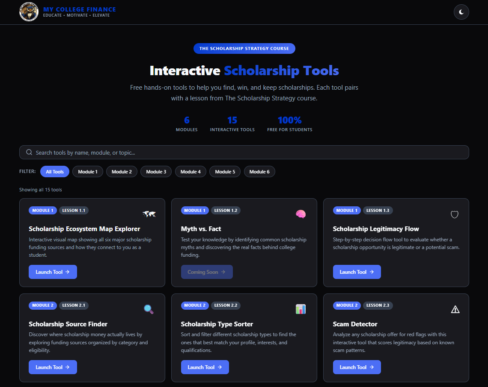

<p align="center">
  
</p>

<h1 align="center">The Scholarship Strategy — Interactive Tools</h1>

<p align="center">
  <strong>EDUCATE &bull; MOTIVATE &bull; ELEVATE</strong>
</p>

<p align="center">
  <a href="https://thiinkmg.github.io/scholarship-strategy-tools/"></a>
  <a href="https://www.mycollegefinance.com/"></a>
  <a href="https://linktr.ee/mycollegefinance"></a>
</p>

<p align="center">
  
  
  
  
  
  
</p>

---

## Screenshot

<p align="center">
  
</p>

---

## About

A collection of **free, interactive HTML tools** that accompany **The Scholarship Strategy** online course by [My College Finance](https://www.mycollegefinance.com/). Each tool is designed to help students actively apply what they learn about finding, winning, and keeping scholarships.

**Live Site:** [https://thiinkmg.github.io/scholarship-strategy-tools/](https://thiinkmg.github.io/scholarship-strategy-tools/)

---

## Interactive Tools by Module

### Module 1 — Scholarships Demystified

| Lesson | Tool | Launch |
|--------|------|--------|
| 1.1 | **Scholarship Ecosystem Map Explorer** — Interactive visual map of all six major scholarship funding sources | [](https://thiinkmg.github.io/scholarship-strategy-tools/module-1/lesson-1-1/) |
| 1.2 | **Myth vs. Fact** — Test your knowledge of common scholarship myths and ROI strategy | [](https://thiinkmg.github.io/scholarship-strategy-tools/module-1/lesson-1-2/) |
| 1.3 | **Scholarship Legitimacy Flow** — Decision flow tool to evaluate scholarship legitimacy | [](https://thiinkmg.github.io/scholarship-strategy-tools/module-1/lesson-1-3/) |

### Module 2 — The Scholarship Hunter System

| Lesson | Tool | Launch |
|--------|------|--------|
| 2.1 | **Scholarship Source Finder** — Discover where scholarship money actually lives by category | [](https://thiinkmg.github.io/scholarship-strategy-tools/module-2/lesson-2-1/) |
| 2.2 | **Scholarship Type Sorter** — Sort and filter scholarships by type and eligibility | [](https://thiinkmg.github.io/scholarship-strategy-tools/module-2/lesson-2-2/) |
| 2.3 | **Scam Detector** — Analyze scholarship offers for red flags and scam patterns | [](https://thiinkmg.github.io/scholarship-strategy-tools/module-2/lesson-2-3/) |

### Module 3 — Build Your Scholarship Application Kit

| Lesson | Tool | Launch |
|--------|------|--------|
| 3.1 | **Scholarship Resume Creator** — Build a scholarship-optimized resume step by step | [](https://thiinkmg.github.io/scholarship-strategy-tools/module-3/lesson-3-1-creator/) |
| 3.1 | **Scholarship Search** — Organize and track scholarship opportunities with deadlines | [](https://thiinkmg.github.io/scholarship-strategy-tools/module-3/lesson-3-1-search/) |
| 3.2 | **Local Scholarship Hunter** — Find hidden local and community scholarship opportunities | [](https://thiinkmg.github.io/scholarship-strategy-tools/module-3/lesson-3-2/) |
| 3.3 | **Essay Block Builder** — Create reusable essay blocks for multiple applications | [](https://thiinkmg.github.io/scholarship-strategy-tools/module-3/lesson-3-3/) |

### Module 4 — Financial Aid Strategy (Dual Track)

| Lesson | Tool | Track | Launch |
|--------|------|-------|--------|
| 4.1A | **Scholarship Timeline Builder** — Plan your scholarship timeline from freshman to senior year |  | [](https://thiinkmg.github.io/scholarship-strategy-tools/module-4/lesson-4-1a/) |
| 4.1B | **College Scholarship Finder** — Discover institutional scholarships at your current college |  | [](https://thiinkmg.github.io/scholarship-strategy-tools/module-4/lesson-4-1b/) |
| 4.2B | **Aid Risk Detector** — Identify risks to your current financial aid package |  | [](https://thiinkmg.github.io/scholarship-strategy-tools/module-4/lesson-4-2b/) |

### Module 5 — Defense Mode: Protecting Your Aid

| Lesson | Tool | Launch |
|--------|------|--------|
| 5.2 | **COA Adjustment Scenarios** — Model cost of attendance adjustment scenarios | [](https://thiinkmg.github.io/scholarship-strategy-tools/module-5/lesson-5-2/) |

### Module 6 — Appeals, Emergency Aid & Staying Enrolled

| Lesson | Tool | Launch |
|--------|------|--------|
| 6.1 | **Appeal Outline Builder** — Build a structured financial aid appeal letter | [](https://thiinkmg.github.io/scholarship-strategy-tools/module-6/lesson-6-1/) |

---

## Technical Details

| Feature | Detail |
|---------|--------|
| Framework | Pure HTML/CSS/JS (no build step) |
| Hosting | GitHub Pages |
| Branding | My College Finance (MCF) brand system |
| Dark Mode | Full light/dark toggle with localStorage |
| Responsive | Mobile-first, tested at 320px-1280px |
| PDF Export | Built-in Save & Download functionality |
| Data Persistence | localStorage for session data |
| Accessibility | Keyboard nav, ARIA labels, semantic HTML |

---

## Usage

### In Browser

Visit any tool directly via its URL or start from the [Interactive Tools Hub](https://thiinkmg.github.io/scholarship-strategy-tools/).

### Embedded (iframe)

Each tool can be embedded in any LMS or website:

```html
<iframe
  src="https://thiinkmg.github.io/scholarship-strategy-tools/module-1/lesson-1-1/"
  width="100%"
  height="800"
  frameborder="0"
  allow="clipboard-write"
></iframe>
```

---

## Repo Structure

```
scholarship-strategy-tools/
├── index.html              ← Hub landing page (search, filter, launch)
├── nav-inject.js           ← Back-nav bar injected into every tool
├── README.md
├── assets/
│   └── screenshot.png
├── module-1/
│   ├── lesson-1-1/index.html    ← Scholarship Ecosystem Map Explorer
│   ├── lesson-1-2/index.html    ← Myth vs. Fact
│   └── lesson-1-3/index.html    ← Scholarship Legitimacy Flow
├── module-2/
│   ├── lesson-2-1/index.html    ← Scholarship Source Finder
│   ├── lesson-2-2/index.html    ← Scholarship Type Sorter
│   └── lesson-2-3/index.html    ← Scam Detector
├── module-3/
│   ├── lesson-3-1-creator/index.html  ← Scholarship Resume Creator
│   ├── lesson-3-1-search/index.html   ← Scholarship Search
│   ├── lesson-3-2/index.html          ← Local Scholarship Hunter
│   └── lesson-3-3/index.html          ← Essay Block Builder
├── module-4/
│   ├── lesson-4-1a/index.html   ← Scholarship Timeline Builder
│   ├── lesson-4-1b/index.html   ← College Scholarship Finder
│   └── lesson-4-2b/index.html   ← Aid Risk Detector
├── module-5/
│   └── lesson-5-2/index.html    ← COA Adjustment Scenarios
└── module-6/
    └── lesson-6-1/index.html    ← Appeal Outline Builder
```

---

## Support & Resources

### Additional Help

- [My College Finance Website](https://www.mycollegefinance.com/)
- [FAFSA Official Website](https://studentaid.gov/h/apply-for-aid/fafsa)
- [Federal Student Aid Help Center](https://studentaid.gov/help-center/answers/topic/fafsa)

### Contact Information

- **Website:** [www.mycollegefinance.com](https://www.mycollegefinance.com/)
- **Social Media:** [@mycollegefinance](https://linktr.ee/mycollegefinance)

---

## License & Copyright

**&copy; 2025 My College Finance. All rights reserved.**

These interactive tools are provided for educational purposes to help students and families navigate the scholarship process effectively. Redistribution or commercial use without permission is prohibited.

> **EDUCATE &bull; MOTIVATE &bull; ELEVATE**

These tools are designed to complement, not replace, official financial aid guidance. Always refer to official sources for the most current requirements and regulations.

---

## Acknowledgments

**Created by:** [Thiink Media Graphics](https://www.thiinkmediagraphics.com/)

**In partnership with:** [My College Finance](https://www.mycollegefinance.com/)

---

## Support

For questions or support, please contact:

- [My College Finance Technical Feedback Form](https://www.mycollegefinance.com/contact)
